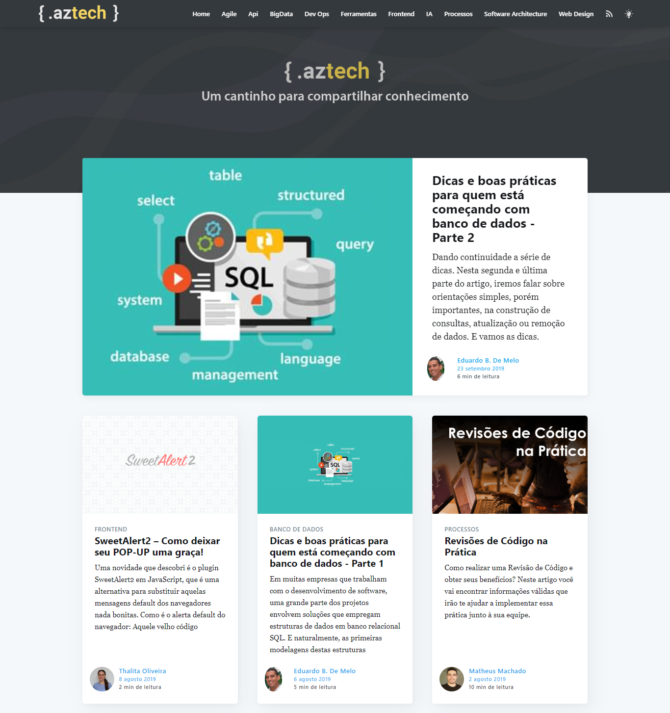

# Tech Blog thema

O tema do nosso blog oficial da empresa [AZ Informatica](http://tech.azi.com.br). Esta é uma versão modificada do tema [Casper](https://github.com/tryghost/casper).

# Screenshot



# Desenvolvimento

Os estilos são compilados usando o Gulp / PostCSS para polyfill futuras especificações de CSS. Você precisará do Node e do Gulp instalados globalmente. Depois disso, no diretório raiz do tema:

```bash
$ yarn install
$ yarn dev
```

Agora você pode editar `/assets/css/` arquivos, os quais serão compilados `/assets/built/` automaticamente.

A tarefa zip do Gulp empacota os arquivos de tema nos `dist/<theme-name>.zip` quais você pode fazer o upload para o seu site.

```bash
$ yarn zip
```
# Referencias

Este tema foi baseado no [Casper](https://github.com/tryghost/casper) e em uma versão alterada para o blog oficial do [ghost](https://github.com/TryGhost/Blog) 

# Copyright & License

Copyright (c) 2013-2019 Ghost Foundation - Released under the [MIT license](LICENSE).
